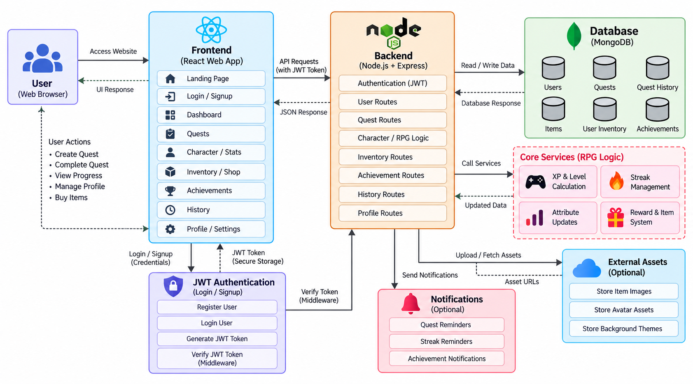

#  The Wizarding Archives

> **Turn your real-world habits, daily routines, and self-improvement into an immersive Hogwarts character progression system.**

---

## 🌟 Live Demo

**Deployed Production App:**  
👉 **[https://life-rpg-phi-eight.vercel.app](https://life-rpg-phi-eight.vercel.app)**

**Live Backend Health Check:**  
👉 **[https://life-rpg-phi-eight.vercel.app/api/health](https://life-rpg-phi-eight.vercel.app/api/health)**

---

## 📖 Overview

**Life RPG** bridges the gap between daily habit tracking and fantasy role-playing games. Completing everyday tasks rewards your character with experience points (XP), Galleons (Gold), discipline progression, and streak multipliers. 

Featuring rich ambient aesthetics inspired by the Hogwarts universe:
- Cinematic midnight castle backdrops with live parallax motion
- 3D interactive Great Hall with rotating viewpoints and floating candles
- A golden snitch circuit animated in 3D perspective across your screen
- Full Light and Dark mode support across 10 custom house and elemental themes

---


https://github.com/user-attachments/assets/c6f35c10-bf50-4458-bba5-ce29d4e7e814


## ✨ Key Features

### 🏰 1. The Sorting Ceremony (Classes)
Begin your journey by getting sorted into one of the four legendary Hogwarts houses:
- **Gryffindor** (Focus: Strength / Transfiguration)
- **Ravenclaw** (Focus: Intelligence / Arithmancy)
- **Slytherin** (Focus: Agility / Flying)
- **Hufflepuff** (Focus: Vitality / Herbology)

*Each house grants a permanent **+25% affinity** to its corresponding discipline and starts your character at Level 3 in that attribute.*

---

### 📊 2. Six Core Discipline Attributes
Quests and habits train specific disciplines, each tracking level curves and progression:
| Attribute | Discipline Equivalent | Real-Life Focus |
|---|---|---|
| **STR** | Transfiguration | Physical fitness, strength, gym routines |
| **INT** | Arithmancy | Coding, engineering, logical reasoning |
| **AGI** | Flying | Running, cardio, agility, speed |
| **VIT** | Herbology | Sleep, nutrition, mindfulness, wellness |
| **WIS** | Ancient Runes | Reading, deep study, writing, philosophy |
| **CHA** | Care of Magical Creatures | Socializing, networking, leadership, teamwork |

---

### ⚔️ 3. Quests, Habits & Streaks
- **Dynamic Task Board**: Categorize activities into Daily Habits, To-Do Quests, and Boggarts (challenging, avoided tasks).
- **Difficulty Tiers**: Trivial, Easy, Medium, Hard, and Legendary with scaled XP and Gold yields.
- **Streak Engine**: Maintain consecutive days of habit completion to unlock streak multipliers and shield bonuses.
- **Streak Shields**: Protect your active streaks from resetting if life gets in the way.

---

### 🏛️ 4. The Emporium (Shop & Collectibles)
Spend earned Galleons to purchase cosmetic themes, boosters, and equipment:
- **Themes**: Hogwarts Midnight, Gryffindor Scarlet, Slytherin Emerald, Ravenclaw Sapphire, Hufflepuff Gold, Obsidian, Emberfall, Tidewatch, Verdant, and Goldleaf.
- **Consumables**: Felix Felicis (XP Elixirs) and Streak Shields.
- **Titles & Badges**: Display prestigious character titles on your wizard profile.

---

### 🏆 5. Achievements & Chronicles
- 21+ built-in unlockable achievements tracking tasks completed, streaks held, gold earned, and house affinities reached.
- Detailed historical analytics and activity heatmaps across 30, 60, and 90-day timeframes.

---

## 🛠️ Architecture & Tech Stack

### 📐 System Architecture Diagram



---

### 📁 Project Directory Structure

```
Life-RPG/
├── client/              # React 18 frontend (Vite, Tailwind, Framer Motion)
│   ├── src/
│   │   ├── components/  # CinemaBackdrop, Great Hall, DashboardShell, Primitives
│   │   ├── pages/       # Landing, Enter (Auth), Onboarding, Dashboard, Keep, Emporium
│   │   ├── styles/      # index.css (Theme system & light/dark color tokens)
│   │   └── lib/         # API client, session management, game rules
├── server/              # Node.js + Express backend
│   ├── src/
│   │   ├── config/      # Database (Mongoose) & Firebase Admin setup
│   │   ├── models/      # Character, Task, GameData schemas
│   │   ├── routes/      # Auth, Me, Tasks, Shop, Stats, Achievements
│   │   ├── services/    # Game definition loader, JWT tokens, streak logic
│   │   └── app.js       # Express application & serverless lifecycle hook
├── api/                 # Vercel Serverless Function entrypoints
│   ├── index.js         # API root handler
│   └── [...path].js     # Catch-all subroute handler
└── vercel.json          # Monorepo unified fullstack build and routing rules
```

- **Frontend**: React 18, Vite 6, Tailwind CSS 3.4, Framer Motion 11, React Router 6.
- **Backend**: Express 4, Node.js (ESM), Mongoose 8, JWT, bcryptjs, Helmet, Compression, Morgan.
- **Database**: MongoDB Atlas.
- **Authentication**: Native JWT with bcrypt password hashing + optional Google Firebase OAuth.
- **Hosting**: Unified Vercel Fullstack Deployment (Vite Client on Edge CDN + Express API on Serverless Functions).

---

## 🚀 Quick Start (Local Development)

### 1. Prerequisites
- [Node.js](https://nodejs.org/) `>= 18.18`
- [MongoDB](https://www.mongodb.com/) (Local instance or free [MongoDB Atlas](https://cloud.mongodb.com) cluster)

### 2. Clone the Repository
```bash
git clone https://github.com/punithsai18/Life-RPG.git
cd Life-RPG
```

### 3. Install Dependencies
```bash
npm install
```
*(This installs root, server, and client dependencies via npm workspaces).*

### 4. Configure Environment Variables
Create a `.env` file inside `server/` (or copy `server/.env.example`):

```env
PORT=4000
NODE_ENV=development
MONGODB_URI=your_mongodb_connection_string
JWT_SECRET=your_super_secret_jwt_key_at_least_32_characters
CORS_ORIGIN=http://localhost:5173,http://localhost:5174
```

*(Optional: Configure Firebase Admin keys in `server/.env` if Google OAuth is desired).*

### 5. Seed Initial Game Definitions
Populate default attributes, difficulties, house classes, and shop items into MongoDB:
```bash
npm --workspace server run seed:game
```

### 6. Start the Development Server
```bash
npm run dev
```
- **Client**: [http://localhost:5173](http://localhost:5173)
- **API**: [http://localhost:4000](http://localhost:4000)

---

## 📡 API Reference

All endpoints are mounted under `/api`:

| Method | Endpoint | Description | Auth Required |
|---|---|---|---|
| `GET` | `/api/health` | Service and database connection status | No |
| `GET` | `/api/rules` | Game constants, difficulty tiers, and XP curves | No |
| `POST` | `/api/auth/signup` | Register a new character | No |
| `POST` | `/api/auth/login` | Login and receive a JWT session token | No |
| `GET` | `/api/auth/me` | Retrieve current authenticated player profile | Yes |
| `POST` | `/api/me/onboarding` | Complete the Sorting and assign starting focus areas | Yes |
| `GET` | `/api/tasks` | List active or archived quests and habits | Yes |
| `POST` | `/api/tasks` | Create a new quest/habit | Yes |
| `POST` | `/api/tasks/:id/complete` | Complete quest (awards XP, Gold, Discipline & Streaks) | Yes |
| `POST` | `/api/tasks/:id/undo` | Revert completion | Yes |
| `DELETE` | `/api/tasks/:id` | Delete a task | Yes |
| `GET` | `/api/shop` | List themes, potions, and equipment available | Yes |
| `POST` | `/api/shop/:id/buy` | Purchase item using Galleons | Yes |
| `POST` | `/api/shop/:id/use` | Equip theme/title or consume elixir | Yes |
| `GET` | `/api/stats` | Retrieve historical XP graphs and task metrics | Yes |
| `GET` | `/api/achievements` | Fetch list of achievements and unlock statuses | Yes |

---

## 🌐 Deploying to Vercel

This repository is pre-configured to deploy seamlessly on Vercel as a single fullstack application:

1. Push your repository to GitHub.
2. In the [Vercel Dashboard](https://vercel.com/new), import the `Life-RPG` project.
3. Keep the **Root Directory** as `./`.
4. Under **Settings > Environment Variables**, add:
   - `MONGODB_URI`: Your MongoDB Atlas connection URI.
   - `JWT_SECRET`: A secure key of 32+ characters.
5. In your MongoDB Atlas dashboard under **Network Access**, ensure **`0.0.0.0/0`** is allowed so Vercel's serverless functions can connect.
6. Click **Deploy**!

---

## 📜 Available Scripts

| Command | Description |
|---|---|
| `npm run dev` | Runs both client and server concurrently in development mode |
| `npm run dev:client` | Starts Vite dev server for the frontend only |
| `npm run dev:server` | Starts the Express server with file watch |
| `npm run build` | Compiles the production React application to `client/dist` |
| `npm start` | Starts the standalone Express server in production mode |
| `npm --workspace server run seed:game` | Seeds default game definitions into MongoDB |

---

## 📄 License

This project is licensed under the [MIT License](LICENSE).
